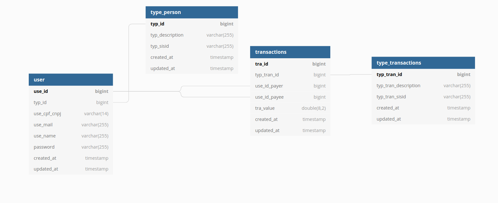

# Financial-backend

A financial back-end, who have two type of users, `Físico` and `Lojista`.

In this project, a login system and transaction system were implemented.

To run this project, have to install [Docker](https://docs.docker.com/engine/install/) and [docker-compose](https://docs.docker.com/compose/install/).

### All routes are configures to run in 
```
localhost/api/
```

### For help, follow swagger documentation
```
http://localhost/api/documentation
```

### To have a better experience, give administrator access

``` bash
sudo chmod 777 -R *
```

## Clone this repository
``` bash
git clone https://github.com/gustamms/financeira-backend.git
```
``` bash
cd financeira-backend
```
``` bash
git checkout main
```
``` bash
cp .env.example .env
```
### Set the Docker's database information on .env
``` bash
docker-compose up -d --build
```
### After services went up

# Create database

``` sql
CREATE DATABASE financial;
```
### On the www path

``` bash
cd www
```
``` bash
cp .env.example .env
```
### Set database information in .env

### Variable DB_HOST, follow this commands

``` bash
docker ps
```

### You'll see this lines

CONTAINER ID | IMAGE | COMMAND | CREATED | STATUS | PORTS | NAMES
--- | --- | --- | --- | --- | --- | --- | 
c522a38f4994 | financeira-backend_webserver | "docker-php-entrypoi…" | 6 minutes ago | Up 6 minutes | 0.0.0.0:80->80/tcp, :::80->80/tcp, 0.0.0.0:443->443/tcp, :::443->443/tcp | webserver
3350944e0d17 | financeira-backend_database | "docker-entrypoint.s…" | 6 minutes ago | Up 6 minutes | 0.0.0.0:3306->3306/tcp, :::3306->3306/tcp, 33060/tcp | database

### In the line, where the IMAGE column is financial-backend_database, take the NAMES and put it in DB_HOST
### And set the database credentials

```
DB_DATABASE=financial
DB_USERNAME=root
DB_PASSWORD=docker
```

## When the webserver and database containers is up, attach the webservice and execute this following commands 

``` bash
composer install
```
``` bash
php artisan jwt:secret --force
```
``` bash
php artisan migrate --seed
```

## To reacreate all database, execute this command
### Remember, this command you'll LOSING all data is in the tables

``` bash
php artisan migrate:refresh --seed
```

### When migrates, are created 3 users like following table

cpfCnpj | Type | password
--- | --- | --- |
96243480143| Física | 1234
94728668320| Física | 123456
06752811000125| Lojista | 12345

To get token, have to make POST request in the 
```url
localhost/api/login
```


The following parameters must be entered in the request body:


```json
{
    "cpfCnpj": "",
    "password": ""
}
```


## To run all unity tests
### Atach shell on webserver and execute this command
```bash
vendor/bin/phpunit
```

## To generate Swagger documentation
``` bash
php artisan swagger-lume:generate
```

## Database Schema



### Improvement proposal

* Create Traits for routes;
* Improved database architecture;
* Creation of microservices for transactions;
